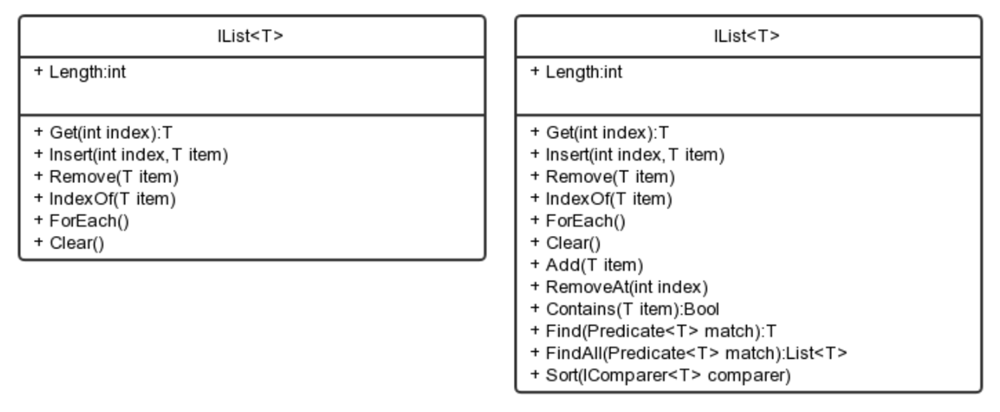

## 设计

## 代码

```javascript
class List {
    constructor() {
        this.items = [];
    }

    get(index) {
        return this.items[index];
    }

    remove(item) {
        var index = this.indexOf(item);
        this.items.splice(index, 1)
    }

    insert(index, item) {
        this.items.splice(index, 0, item)
    }

    indexOf(item) {
        return this.items.indexOf(item);
    }

    forEach(fn) {
        this.items.forEach(function (item, i) {
            fn(item, i);
        })
    }

    clear() {
        this.items = [];
    }
}
```


