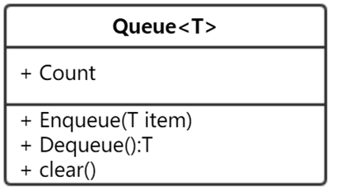

## 设计

## 代码

```javascript
class Queue {

    constructor(data) {
        this.items = [];
    }

    get count() {
        return this.items.length;
    }

    EnQueue(item) {
        this.items.push(item);
    }

    DeQueue() {
        return this.items.shift();
    }

    clear() {
        this.items = [];
    }
}


```


