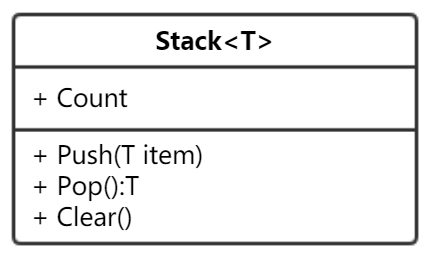

## 设计

## 代码

```javascript
class Stack {

    constructor(data) {
        this.items = [];
    }

    get count() {
        return this.items.length;
    }

    push(item) {
        this.items.push(item);
    }

    pop() {
        return this.items.pop();
    }

    clear() {
        this.items = [];
    }
}


```


